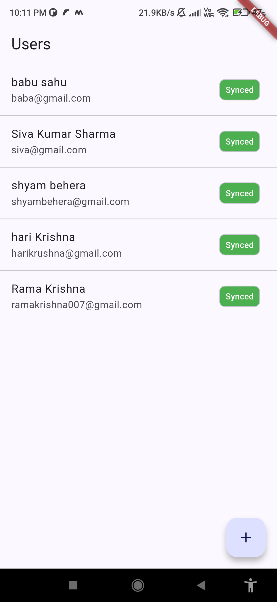
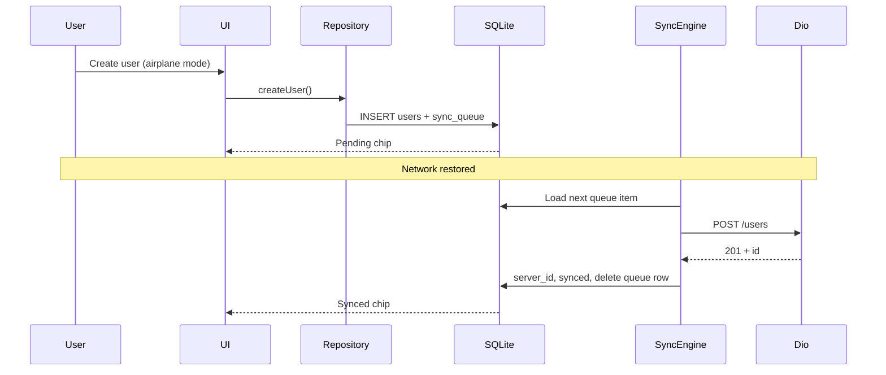
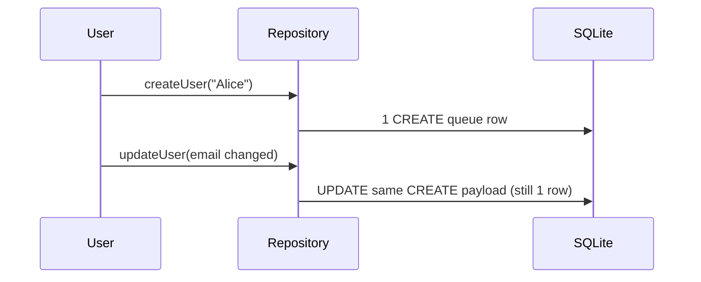

# Flutter Offline Data Sync

Offline-first Flutter app for **Android** and **iOS**. Users can be **created and updated without internet**; changes are saved locally in **SQLite (sqflite)**, queued for sync, and **automatically pushed to the server** when connectivity returns — using **Dio** and **JSONPlaceholder**.

---

## Download APK (Android)

| Source | Link |
|--------|------|
| **Project file** | [`media/offline-data_sync.apk`](media/offline-data_sync.apk) |
| **GitHub (raw)** | [Download APK](https://github.com/ghanashyambehera/flutter_offline_data/raw/master/media/offline-data_sync.apk) |

> Install on a device: enable **Install from unknown sources**, then open the APK file.
>
> Build a fresh APK locally:
> ```bash
> flutter build apk --debug
> # output: build/app/outputs/flutter-apk/app-debug.apk
> ```

---

## Demo — Screenshot & Video

Media files are in the [`media/`](media/) folder.

### App screenshot



Shows the user list with sync status chips (**Pending**, **Synced**, **Failed**) and the offline banner.

### Demo video

[▶ Watch demo video (`media/video.mp4`)](media/video.mp4)

The video demonstrates offline create/update and auto-sync when network is restored.

| File | Description |
|------|-------------|
| [`media/image.png`](media/image.png) | App screenshot |
| [`media/video.mp4`](media/video.mp4) | Full flow demo (offline → sync) |
| [`media/offline-data_sync.apk`](media/offline-data_sync.apk) | Installable Android APK |

---

## What this app does

| Capability | Detail |
|------------|--------|
| Offline create | Save user locally immediately; no network required |
| Offline update | Edit name, email, job offline; UI updates instantly |
| Sync queue | Every mutation is stored in a durable FIFO queue |
| Auto-sync | Queue drains automatically — **no Sync / Retry button** |
| Status UI | Each row shows **Synced**, **Pending**, or **Failed** |
| Platforms | Android + iOS |

---

## Architecture

```
┌─────────────────────────────────────────────────────────┐
│  UI (User list, form, offline banner, sync chips)       │
└───────────────────────────┬─────────────────────────────┘
                            │
┌───────────────────────────▼─────────────────────────────┐
│  UserRepository                                         │
│  createUser / updateUser / watchUsers                   │
│  (SQLite transaction: user row + queue row)             │
└─────────────┬───────────────────────────┬───────────────┘
              │                           │
              ▼                           ▼
┌─────────────────────┐     ┌─────────────────────────────┐
│  UserLocalDataSource│     │  SyncEngine                 │
│  sqflite            │     │  drain queue → Dio API      │
│  users + sync_queue │     │  retry / backoff / mutex    │
└─────────────────────┘     └──────────────┬──────────────┘
                                           │
              ┌────────────────────────────┼────────────────┐
              ▼                            ▼                ▼
   ConnectivityService          UserRemoteDataSource    SyncCoordinator
   (online / offline)          (JSONPlaceholder)       (lifecycle triggers)
```

---

## Offline sync flow (end-to-end)

### 1. Create or update (always local-first)

```
User taps Save
    → Validate (name, email)
    → SQLite transaction:
         • UPDATE/INSERT users row  (pending_create / pending_update)
         • INSERT or coalesce sync_queue row (CREATE or UPDATE)
    → Commit
    → UI refreshes from local DB (watchUsers stream)
    → If online: SyncEngine.trySync()
```

**Key rule:** UI never calls Dio directly. All reads come from SQLite.

### 2. Sync queue (FIFO + coalescing)

Each pending mutation is a row in `sync_queue`:

| Field | Purpose |
|-------|---------|
| `operation` | `CREATE` or `UPDATE` |
| `local_id` | Device UUID (primary identity) |
| `server_id` | Remote id after successful POST |
| `payload_json` | Latest name, email, job snapshot |
| `status` | `pending` → `in_progress` → deleted on success |
| `attempt_count` | Retry counter (max 5) |

**Coalescing:** If a user is edited **before** first sync, multiple edits merge into **one CREATE** payload — no duplicate queue rows.

### 3. Auto-sync triggers

`SyncCoordinator` calls `SyncEngine.trySync()` when:

| Trigger | When |
|---------|------|
| Connectivity restored | Offline → Wi‑Fi / mobile |
| App cold start | DB open + online |
| App resumed | `AppLifecycleState.resumed` + online |
| After local save | Create/update commit + currently online |

There is **no manual Sync button**.

### 4. SyncEngine processing

```
trySync()
  → Skip if offline or already running (mutex)
  → Reset stuck in_progress → pending (crash recovery)
  → Loop pending queue (FIFO, skip blocked items):
       CREATE → POST /users  → store server_id, mark synced, delete queue row
       UPDATE → PUT /users/{id} → mark synced, delete queue row
  → On retryable error: exponential backoff (2s … 32s), max 5 attempts
  → On non-retryable / max attempts: mark user + queue as failed
  → Repeat until queue is empty (multi-record sync)
```

### 5. Connectivity

`ConnectivityService` uses `connectivity_plus`:

- `none` → offline (show banner: *"Offline — changes will sync automatically"*)
- `wifi` / `mobile` / `ethernet` → online → trigger sync

---

## Sequence diagrams

### Offline create → reconnect → synced



### Edit before first sync (coalescing)



---

## Local database (sqflite)

**File:** `offline_sync.db` · **Version:** 2

### `users` table

| Column | Description |
|--------|-------------|
| `local_id` | UUID primary key (generated on device) |
| `server_id` | Id from API after POST (not unique — JSONPlaceholder returns same id) |
| `name`, `email`, `job` | User fields |
| `sync_status` | `pending_create` / `pending_update` / `synced` / `failed` |
| `last_error` | Shown on Failed rows (read-only, no retry button) |

### `sync_queue` table

Durable FIFO queue linked to `users.local_id` via foreign key.

---

## Remote API (JSONPlaceholder)

| Operation | HTTP | Endpoint |
|-----------|------|----------|
| Create | `POST` | `https://jsonplaceholder.typicode.com/users` |
| Update | `PUT` | `https://jsonplaceholder.typicode.com/users/{id}` |

**Important:** JSONPlaceholder is a **fake API** — it returns `2xx` and an `id`, but **does not persist data**. Multiple creates may receive the same `id` (e.g. `11`). The app treats HTTP success + parseable `id` as synced locally.

---

## Tech stack

| Layer | Package |
|-------|---------|
| Local DB | `sqflite` |
| HTTP | `dio` |
| Connectivity | `connectivity_plus` |
| IDs | `uuid` |
| State (UI) | `provider` |

---

## Project structure

```
lib/
  main.dart                          # Entry point
  app.dart                           # DI wiring, SyncCoordinator start
  core/
    database/                        # Schema, AppDatabase, change bus
    network/                         # Dio client, ApiConfig
    connectivity/                    # ConnectivityService
  features/users/
    domain/                          # User entity, repository interface, validation
    data/
      models/                        # UserLocal, SyncQueueItem, UserDto
      datasources/                   # Local + remote data sources
      repositories/                  # UserRepositoryImpl
    sync/                            # SyncEngine, SyncPolicy, SyncCoordinator
    presentation/                    # UserListPage, UserFormPage

docs/
  REQUIREMENTS_ANALYSIS.md           # What to build
  DESIGN.md                          # How it is built
  QA_CHECKLIST.md                    # Manual test steps

prompts/                             # Phase-by-phase implementation prompts

media/
  image.png                          # App screenshot
  video.mp4                          # Demo video
  offline-data_sync.apk              # Android APK
```

---

## Getting started

### Prerequisites

- Flutter SDK 3.x ([FVM recommended](https://fvm.app/))
- Android Studio / Xcode for device simulators

### Run on device / emulator

```bash
flutter pub get
flutter run
```

### Build APK

```bash
flutter build apk --debug
# or release:
flutter build apk --release
```

### Test & analyze

```bash
flutter test
flutter analyze
```

---

## Manual QA (quick)

1. **Airplane mode ON** → create user → see **Pending**
2. **Airplane mode OFF** → wait a few seconds → **Synced** (no button tap)
3. Create **multiple users offline** → reconnect → **all should sync**
4. Edit offline → list updates immediately → syncs on reconnect

Full checklist: [`docs/QA_CHECKLIST.md`](docs/QA_CHECKLIST.md)

---

## Known limitations (v1)

- Create + update only (no delete, no server GET list)
- Auto-sync in foreground / resume (no background Workmanager)
- JSONPlaceholder duplicate `server_id` handled locally (schema v2)
- No auth / login

---

## Documentation

| Document | Purpose |
|----------|---------|
| [`docs/REQUIREMENTS_ANALYSIS.md`](docs/REQUIREMENTS_ANALYSIS.md) | Requirements & acceptance criteria |
| [`docs/DESIGN.md`](docs/DESIGN.md) | Architecture, schema, sync algorithms |
| [`docs/QA_CHECKLIST.md`](docs/QA_CHECKLIST.md) | Manual QA steps |
| [`prompts/README.md`](prompts/README.md) | Implementation prompts (phases 01–08) |

---

## License

Private / example project. See repository for details.
